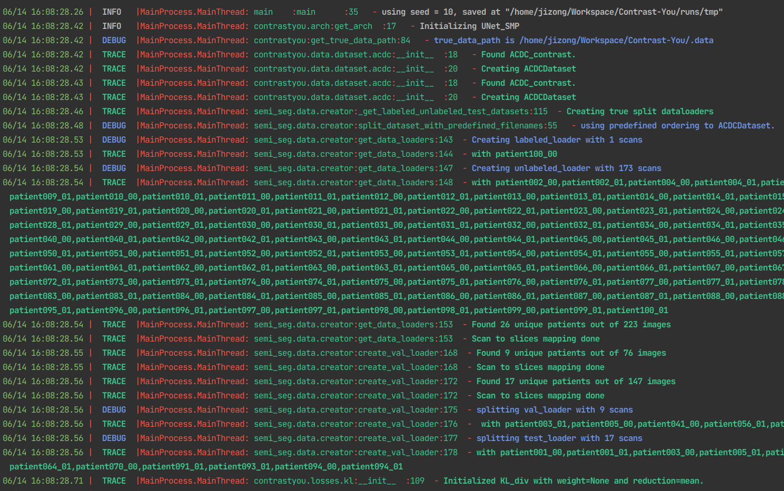

# Contrast You: a scalable medical image segmentation framework
-----
`contrastyou` is a scalable medical image segmentation framework realized during my Ph. D studies at
the [École de technologie supérieure (ÉTS)](https://www.etsmtl.ca/).

This framework resulted in several papers, including:

* [Boundary-aware Information Maximization for Self-supervised Medical Image Segmentation](https://arxiv.org/abs/2202.02371)

* [Diversified Multi-prototype Representation for Semi-supervised Segmentation](https://arxiv.org/pdf/2111.08651.pdf)

* [Self-Paced Contrastive Learning for Semi-supervised Medical Image Segmentation with Meta-labels](https://proceedings.neurips.cc/paper/2021/hash/8b5c8441a8ff8e151b191c53c1842a38-Abstract.html)

* [Boosting semi-supervised image segmentation with global and local mutual information regularization](https://www.melba-journal.org/papers/2021:009.html)

* [Mutual information deep regularization for semi-supervised segmentation](https://openreview.net/forum?id=iunvffXgPm)

## Features

-------

* Configurable configuration management

```bash
python main_nd.py -o Trainer.name=ft -p config/base.yaml
```


----

* Automatic Trainer checkpointing and resuming

```python
class Trainer(IOMixin, HookMixin, DDPMixin, AMPScalerMixin, ModuleBase):
    RUN_PATH = MODEL_PATH  # type:str # absolute path

    def __init__(self, *, model: nn.Module, criterion: LossClass[Tensor], tra_loader: SizedIterable,
                 val_loader: SizedIterable, save_dir: str, max_epoch: int = 100, num_batches: int = 100, device="cpu",
                 config: Dict[str, Any], enable_scale: bool = False, accumulate_iter: int = 1) -> None:
        super().__init__(enable_scale=enable_scale, accumulate_iter=accumulate_iter)
        self._initialized = False

        self._model = self._inference_model = model
        self._criterion = criterion
        self._tra_loader = tra_loader
        self._val_loader = val_loader
        self._save_dir = cast(str, Buffer(save_dir))  # persisting automatically
        self._max_epoch = cast(int, Buffer(max_epoch))  # persisting automatically
        self._num_batches = Buffer(num_batches)  # persisting automatically
        self._device = device
        self.config = cast(dict, Buffer(config))  # persisting automatically
        self._config = self.config
```

-------

* Extenable Epochers

```python
class EpocherBase(AMPScaler, DDPMixin, metaclass=ABCMeta):
    """ EpocherBase class to control the behavior of the training within one epoch.
    >>> hooks = ...
    >>> epocher = EpocherBase(...)
    >>> with epocher.register_hook(*hooks):
    >>>     epocher.run()
    >>> epocher_result, best_score = epocher.get_metric(), epocher.get_score()
    """
    ...


class SemiSupervisedEpocher(EpocherBase, ABC):
    meter_focus = "semi"

    def _assertion(self):
        assert_transform_freedom(self._labeled_loader, False)
        if self._unlabeled_loader is not None:
            assert_transform_freedom(self._unlabeled_loader, False)

    def __init__(self, *, model: nn.Module, optimizer: optimizerType, labeled_loader: SizedIterable,
                 unlabeled_loader: SizedIterable, sup_criterion: criterionType, num_batches: int, cur_epoch=0,
                 device="cpu", two_stage: bool = False, disable_bn: bool = False, scaler: GradScaler,
                 accumulate_iter: int = 1, **kwargs) -> None:
        super().__init__(model=model, num_batches=num_batches, cur_epoch=cur_epoch, device=device, scaler=scaler,
                         accumulate_iter=accumulate_iter)
        self._optimizer = optimizer
        self._labeled_loader: SizedIterable = labeled_loader
        self._unlabeled_loader: SizedIterable = unlabeled_loader
        self._sup_criterion = sup_criterion
        ...


class FineTuneEpocher(SemiSupervisedEpocher, ABC):
    meter_focus = "ft"

    def __init__(self, *, model: nn.Module, optimizer: optimizerType, labeled_loader: dataIterType,
                 sup_criterion: criterionType, num_batches: int, cur_epoch=0, device="cpu", scaler: GradScaler,
                 accumulate_iter: int, **kwargs) -> None:
        super().__init__(model=model, optimizer=optimizer, labeled_loader=labeled_loader, sup_criterion=sup_criterion,
                         num_batches=num_batches, cur_epoch=cur_epoch, device=device, scaler=scaler,
                         accumulate_iter=accumulate_iter, **kwargs)

    def configure_meters(self, meters: MeterInterface) -> MeterInterface:
        meters = super().configure_meters(meters)
        meters.delete_meter("reg_loss")
        return meters

    ...

```

----

* Scalable Meters

```python
class EvalEpocher(EpocherBase):
    meter_focus = "eval"

    ...

    def configure_meters(self, meters: MeterInterface) -> MeterInterface:
        C = self.num_classes
        report_axis = list(range(1, C))
        meters.register_meter("loss", AverageValueMeter())
        meters.register_meter("dice", UniversalDice(C, report_axis=report_axis))
        return meters

    ...

    def _batch_update(self, *, eval_img, eval_target, eval_group, file_names):
        with self.autocast:
            eval_logits = self._model(eval_img)
            onehot_target = class2one_hot(eval_target.squeeze(1), self.num_classes)
            eval_loss = self._sup_criterion(eval_logits.softmax(1), onehot_target, disable_assert=True)

        self.meters["loss"].add(eval_loss.item())
        self.meters["dice"].add(eval_logits.max(1)[1], eval_target.squeeze(1), group_name=eval_group)

    ....
```

-----

* Confortable logging with [Loguru](https://github.com/Delgan/loguru)


logger with info: `Export LOGURU_LEVEL=INFO`

logger with trace: `Export LOGURU_LEVEL=TRACE`

----

* Extendable Hooks for semi-supervised learning
```python
 with hook_registration(*hooks):
    trainer.init()
    if checkpoint:
        trainer.resume_from_path(checkpoint)
    trainer.start_training()
    return trainer.inference(checkpoint_path=checkpoint)
```

#### Maybe adding consistency?

```bash
python main_nd.py -o Trainer.name=semi -p config/base.yaml config/hooks/consistency.yaml
```


#### Maybe adding MeanTeacher?

```bash
python main_nd.py -o Trainer.name=semi -p config/base.yaml config/hooks/mt.yaml
```


#### Maybe adding consistency, mutual information, and infonce?

```bash
python main_nd.py -o Trainer.name=semi -p config/base.yaml config/hooks/mt.yaml \ 
config/hooks/consistency.yaml config/hooks/infonce_encoder.yaml -o InfonceParams.feature_names=layer4 
```


-----

* Tenosrboard integration for experiments


---

* [Good Cluster submittor for experiments](contrastyou/submitter2.py)

* [AMP support](contrastyou/amp/amp.py)
* [DDP support](contrastyou/amp/ddp.py)

-----
##### Citations:
```latex
@article{peng2022boundary,
  title={Boundary-aware Information Maximization for Self-supervised Medical Image Segmentation},
  author={Peng, Jizong and Wang, Ping and Pedersoli, Marco and Desrosiers, Christian},
  journal={arXiv preprint arXiv:2202.02371},
  year={2022}
}
@article{peng2021diversified,
  title={Diversified Multi-prototype Representation for Semi-supervised Segmentation},
  author={Peng, Jizong and Desrosiers, Christian and Pedersoli, Marco},
  journal={arXiv preprint arXiv:2111.08651},
  year={2021}
}
@article{peng2021self,
  title={Self-paced contrastive learning for semi-supervised medical image segmentation with meta-labels},
  author={Peng, Jizong and Wang, Ping and Desrosiers, Christian and Pedersoli, Marco},
  journal={Advances in Neural Information Processing Systems},
  volume={34},
  year={2021}
}
@article{peng2021boosting,
  title={Boosting semi-supervised image segmentation with global and local mutual information regularization},
  author={Peng, Jizong and Pedersoli, Marco and Desrosiers, Christian},
  journal={arXiv preprint arXiv:2103.04813},
  year={2021}
}

```

